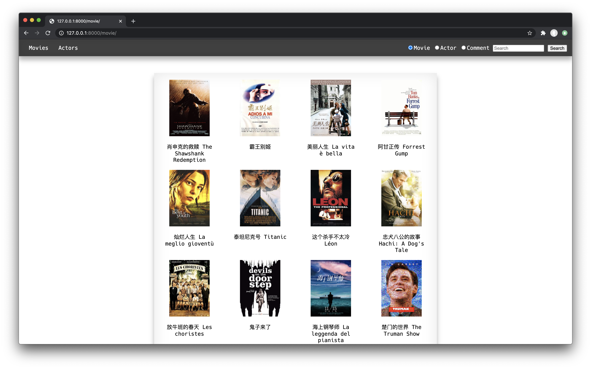
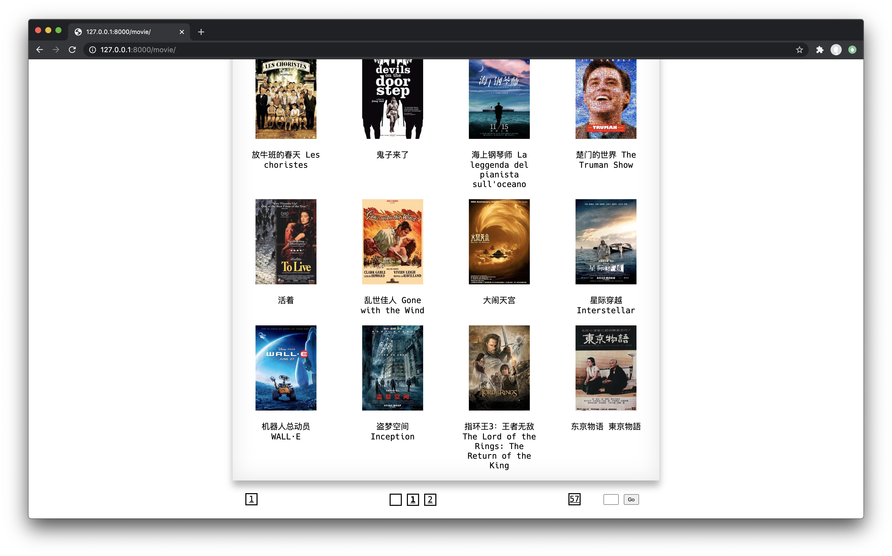
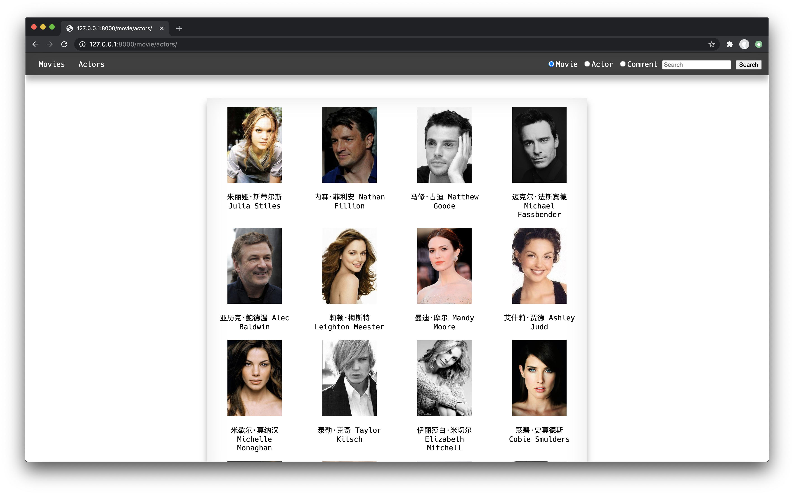
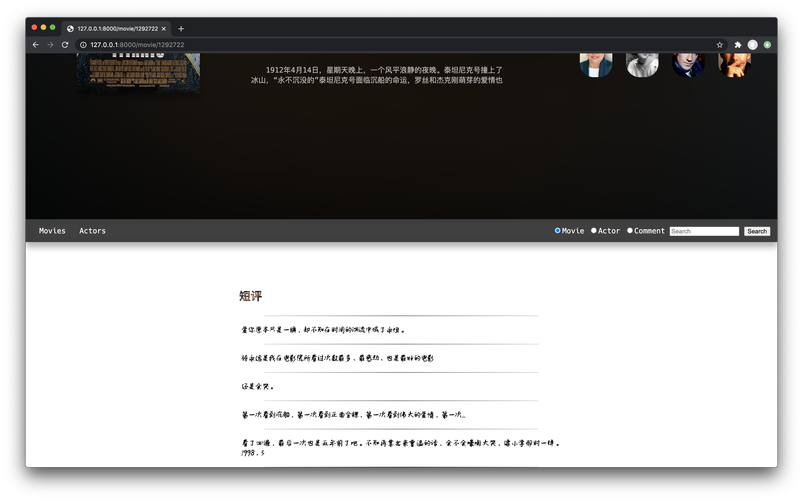
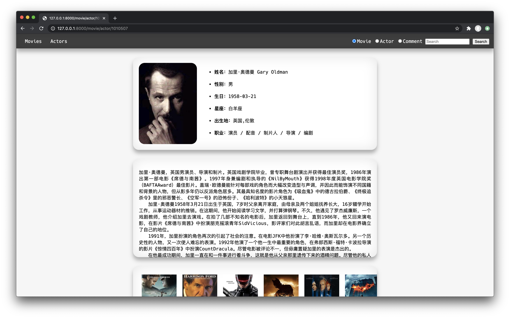
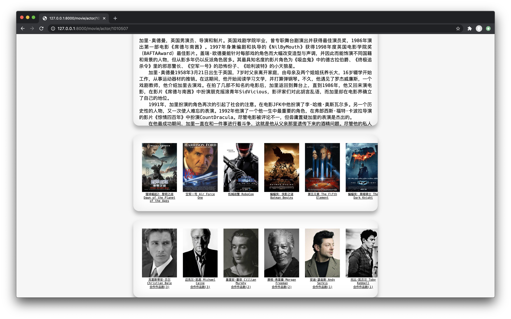
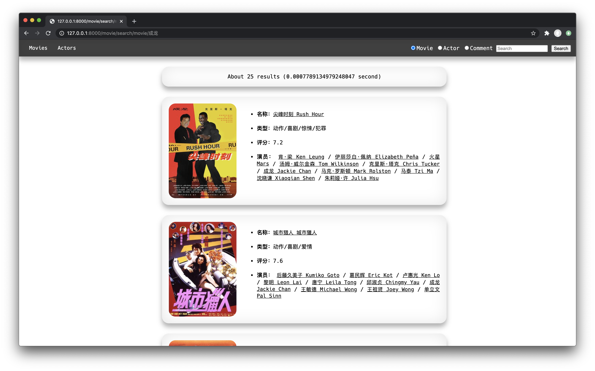
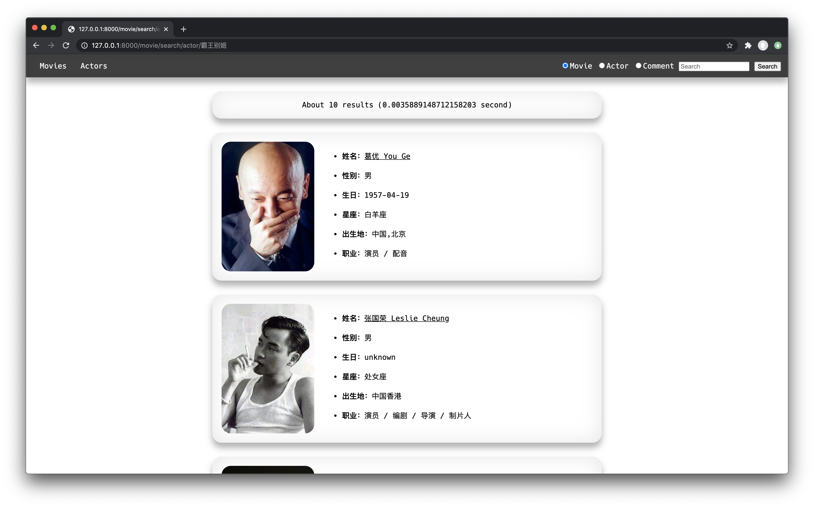
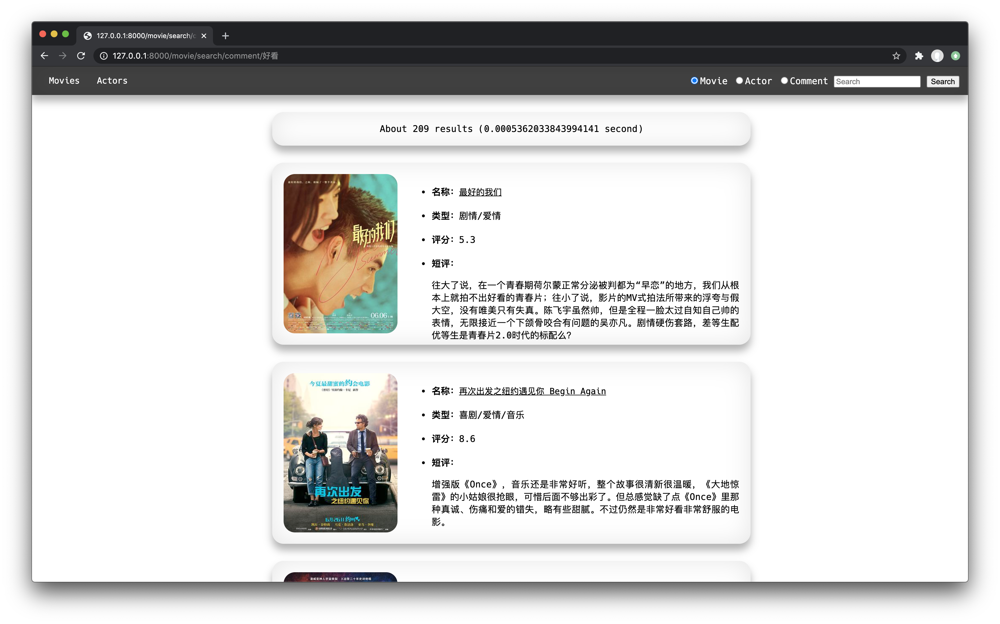

[TOC]

# 功能展示

## 导航栏

在每个页面的顶部都存在导航栏，导航栏负责页面的跳转和影片、演员的搜索功能。在大多数的页面中，导航栏都位于最顶部，而在电影详情页中，出于美观的考虑，导航栏是被放置在电影的信息页下的。

## 影片列表页

页面的首页是电影列表页，展示了影片的基本信息。页面主要分为三部分，分别是顶部的导航栏、底部的页面分栏和中间的详细信息展示。其中每页分为五行，每行四个电影，即一页共二十个影片。在最右边的文本框中输入相关的页码，点击即可进行跳转。

导航栏和分页栏在所有的页面中都存在，并且负责一样的功能。

## 演员信息列表页

同影片信息列表页，我们在中间的卡片中展示了当页的所有演员，每页分为四行，每行有五个。

## 电影详情页

在电影列表页点击相应的影片，会跳转进入到电影详情页。在最左边展示了相应的影片封面，中间自上而下分别是影片的标题和简介。最右边自上而下分别是影片的评分、分类以及相应的演员。其中，演员是可以横向滑动的，每个影片都有十个演员。

往下滑动，可以看到相应的短评。每个影片的短评有五条，以分割线相隔开。可以注意到，我们把导航栏放到了中间的位置。

## 演员信息页

演员信息页的内容主要分为四个部分，第一个部分包括了演员的照片和基本信息，第二个部分展示了演员的介绍信息，第三个部分展示了其参演过的电影，第四个部分展示了与其合作过的演员。

## 电影搜索页

在任意一个页面的导航栏中，点击相应的搜索框，选中要搜索的分类，即可进入到电影搜索页。如果某个电影的名称或者其参演的演员的名称有匹配的自传，那么我们同样会以卡片的形式展示出相应的信息。同时，对于每个搜索的内容，我们还会再最上方提示搜索用时和搜索的结果的数量。

## 演员搜索页

类似于电影信息页，对演员进行搜索时，如果某个演员的姓名匹配上或者其出演过的电影匹配上，那么我们就会将这个演员展示出来。

## 短评搜索页

同样的，我们也可以对一个影片的评论进行搜索。其展示的信息与电影搜索页类似，不同的是我们会将所匹配的评论信息一并展示出来。

# 统计信息

## 爬虫数据总量

在爬虫的数据量方面，我选择了豆瓣电影进行抓取。其中在五个分类下，每个分类爬取三百部影片和相关的演员，去重后剩余  1100 部影片和 6000 个左右的演员。

## 查询时间

在数据的存储上，我选择 django 自带的数据库 SQLite 作为后端，由于数据量并不大，实际测试中每次的查询时间不会超过 10ms。

# 技术细节

## 爬虫

在实现爬虫时，我直接使用了 urllib 来实现网络请求，用正则表达式来解析相关的内容并且使用 json 来存储相关的数据。在实际运行时，遇到了若干问题，例如如果使用 python 中的 fake_useragent 来随机生成请求 header 的话，有可能会被豆瓣的反爬机制直接 418 拒接，但是使用一个固定的 header 则不会出现这种问题。同时，由于网络问题，有时候对一个网址的内容反复请求可能会被直接拒绝，但是再请求同一站点的其他内容就没有问题。因此，我把所有的请求放到了一个队列中，如果一个请求被拒接，就重新加入到队尾，直接开始处理下一个请求。

## 前端

在实现网页前端时，我并没有依赖现存的例如 Bootstrap 之类的框架。在实现时用的精力比较多的是电影信息的展示页。为了实现一个比较美观的效果，我希望将电影的封面图进行高斯模糊之后作为影片信息页的背景图。为了实现这个功能，我首先将封面图放到一个 div 中作为一个背景图，然后在内层加一个 div 作为高斯模糊的遮罩。从实际来看也确实实现了不错的效果。

另一个部分就是我在设计时采用了比较多的 Material Design 的元素，用大量的阴影和卡片效果来实现内容层次的区分。当然由于时间的限制，我的实现还是比较简单的，并没有加入一些必要的动画效果。

## 后端

在后端方面，因为我们使用的 Django 已经是一个非常成熟的框架了，而我们需要实现的功能也是一个非常常见的需求。所以我们只需要调用一些现有的轮子就可以了。

例如，对于影片列表页和演员列表页，我们只需要使用 Django 的 ListView，只需要将所需的相应的数据库的缩进填进去即可。更好的是，ListView 还实现好了分页的功能，因此我们只需要直接调用后实现前段的页面即可。

因此，本次工程中比较重头的部分就是实现搜索功能了。并且在一定程度上来说，我们需要实现的搜索规则还是相对复杂的。例如，当我们需要搜索影片时，即需要将匹配相应的影片的标题，又需要匹配相应的影片的演员的姓名。要实现这些功能，就需要学习使用 Django 的 ManyToManyField 等之类的模块。ManyToManyField 可以在两个互相独立的数据库之间建立映射关系，非常适合我们这种一个演员出演过多个电影，而一个电影又有多个演员参与的情况。

利用 ManyToManyField，我们就可以将影片的名字和演员的姓名分别作为 filter 的字段查询，最后去重即可。

